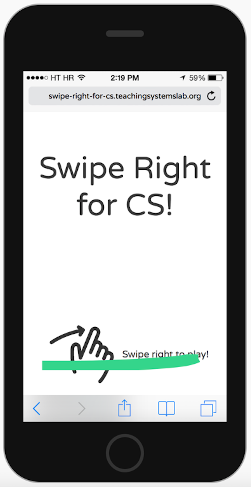
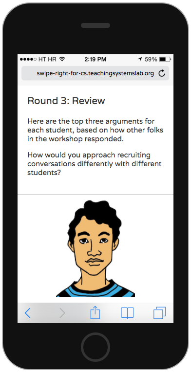
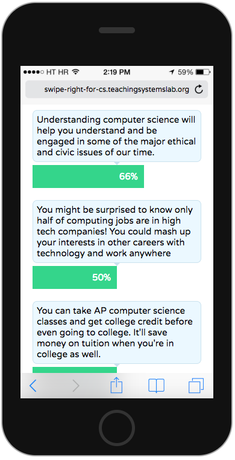

# swipe-right-for-cs
<a href="https://swipe-right-for-cs.herokuapp.com/play?github"></a>

A game for teachers to practice empathizing with young people and authentically connecting their strengths and interests to computer science.  Active recruiting is an important part of progress towards CS for All.

  <a style="display: block; text-align: center;" href="https://swipe-right-for-cs.herokuapp.com/play?github"><p align="center"></p></a>

This was originally developed in partnership with Code.org for use in quarterly teacher workshops, but the game is openly licensed and anyone is welcome to use it!  It includes discussion points for small groups, and links to online discussion forums at the end as well.

  <a style="display: block; text-align: center;" href="https://swipe-right-for-cs.herokuapp.com/play?github"><p align="center">></p></a>

Here are links to the [facilitator lesson plan](https://curriculum.code.org/plcsp/q2/6/), a [link to the game](https://studio.code.org/levels/10398) that requires Code Studio login and a [link to the game that anyone can try](https://swipe-right-for-cs.herokuapp.com/play?github) as a demo or for use in PLCs or other workshop formats.

## Development
To setup locally:
```
$ yarn install
$ yarn db-create 
```

### To develop locally:
```
$ yarn start
```

This will run the server and the create-react-app development server in parallel, writing the output of both to stdout.

Note that the site is responsive and will include a fake frame for an iPhone 5 running Safari at desktop resolution.

Running `yarn start` will also start a [storybook](https://github.com/storybooks/storybook) server on port 9001.  You can use this to create "stories" iterate on UI features.


To develop on device:
```
$ yarn run grok
```

Then open that URL on your phone.


### To run tests:
```
$ yarn db-create-dev
$ yarn test
```

If you want to run the tests, you should create a similar database called "swipe-right-db-test".

You can also run the linter and tests independently for the server or client code, see `package.json` for commands.

## Profiles and arguments
These are created in spreadsheet and then imported into the app as CSV files.  If you'd like to revise these or create new profiles or arguments, open an issue or reach out at krob@mit.edu or [@mit_tsl](https://twitter.com/mit_tsl)!
